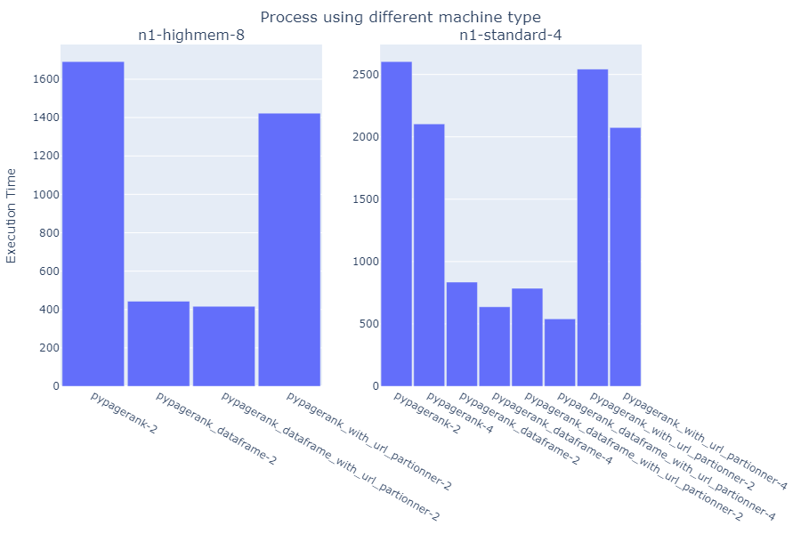

Sewraj Hreshvik, Sisarith Elisabeth, Stucky Nicolas
# PageRank2024

*Crédit* : Le code est basé sur celui de [https://github.com/momo54/large_scale_data_management](https://github.com/momo54/large_scale_data_management)

L'URL ayant obtenu le meilleur classement est `<http://dbpedia.org/resource/Living_people>`, avec un score de 36794.33146754498.

## Résultats

Les implémentations *pypagerank* correspondent aux méthodes avec RDD et *pypagerank_dataframe* aux méthodes utilisant des DataFrames sans url partionner.

*Figure 1 : Résultats de l'exécution sur n1-highmem-8.*

Dans ce graphique, nous comparons les différentes méthodes utilisant 1 nœud ("-0") et 2 nœuds ("-2").  
Il manque le pypagerank_dataframe_with_url_partionner-0 car son exécution produit une erreur.  
Nous n'avons pas réussi à faire tourner les processus sur 4 nœuds car il n'est pas possible de réserver 4 machines n1-highmem-8. Aussi, nous n'avons pas pu faire tourner sur les n1-standard-4 avec 1 seul nœud. 

Nous avons donc réexécuté les codes sur 2 nœuds, cette fois sur les machines n1-standard-4 pour avoir une base de comparaison avec ceux sur 4 nœuds sur ces mêmes machines.  

*Figure 2 : Comparaison des performances sur n1-highmem-8 et n1-standard-4.*